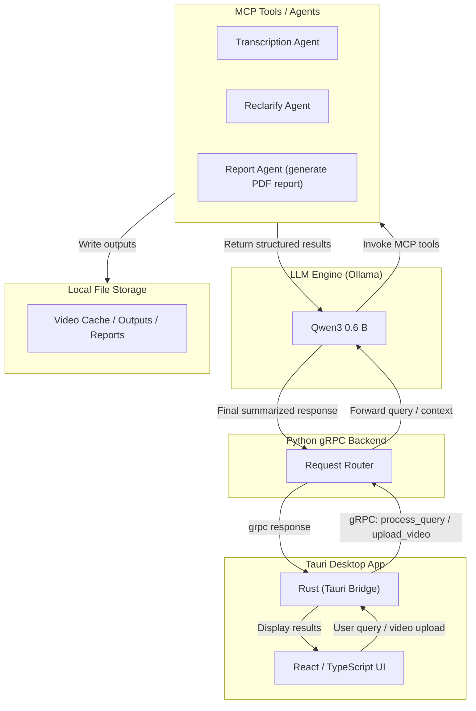

```mermaid
flowchart TD

    %% ────────────────────────────────
    %%  A. Desktop App
    %% ────────────────────────────────
    subgraph A["Tauri Desktop App"]
        A1["React / TypeScript UI"]
        A2["Rust (Tauri Bridge)"]
    end
    A1 -->|"User query / video upload"| A2

    %% ────────────────────────────────
    %%  B. Backend
    %% ────────────────────────────────
    subgraph B["Python gRPC Backend"]
        B1["Request Router"]
    end
    A2 -->|"gRPC: process_query / upload_video"| B1

    %% ────────────────────────────────
    %%  C. LLM Engine
    %% ────────────────────────────────
    subgraph C["LLM Engine (Ollama)"]
        C1["Qwen3 0.6 B"]
    end
    B1 -->|"Forward query / context"| C1

    %% ────────────────────────────────
    %%  D. Tools Layer
    %% ────────────────────────────────
    subgraph D["MCP Tools / Agents"]
        D1["Transcription Agent"]
        D2["Reclarify Agent"]
        D3["Vision Agent (Object Detection)"]
        D3["Report Agent (generate PDF report)"]
    end
    C1 -->|"Invoke MCP tools"| D
    D -->|"Return structured results"| C1

    %% ────────────────────────────────
    %%  E. Local Storage
    %% ────────────────────────────────
    subgraph E["Local File Storage"]
        E1["Video Cache / Outputs / Reports"]
    end
    D -->|"Write outputs"| E

    %% ────────────────────────────────
    %%  Response Path
    %% ────────────────────────────────
    C1 -->|"Final summarized response"| B1
    B1 -->|"grpc response"| A2
    A2 -->|"Display results"| A1

```