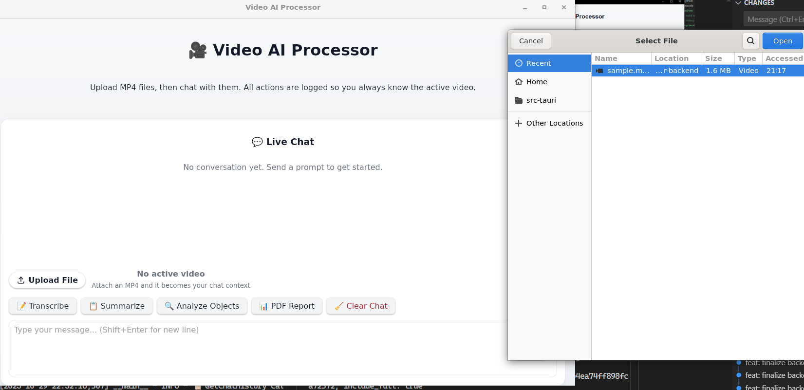

## PROJECT: Multi Agent MCP Video Analyser

- Allow users t- select and upload local .mp4 files. 
- Support natural language interaction t- process and query vide- content. 
- Example user queries: 
    - “Transcribe the video.” 
    - “Create a PowerPoint with the key points discussed in the video.” 
    - “What objects are shown in the video?” 
    - “Are there any graphs in the video? If yes, describe them.” 
    - “Summarize our discussion s- far and generate a PDF.” 

### Startup screen


### Ability to:
- Detect objects and entities in the video file
- generate transcripts for the video file
- generate summary reports in PDF
- ask the human to reclarify their question
- remember past 5 conversation and load on UI startup

#### Detect objects


#### Generate Transcript


#### Generate PDF Summary Report


#### Low Confidence Detection back t- human in the loop


## Pre-requisites
- mp4 files for testing, e.g. https://file-examples.com/index.php/sample-video-files/sample-mp4-files/


## Startup commands (local)

### backend
```
cd video-analyser-backend/
# install deps
uv sync 
uv run python -m server
```

### frontend
```
cd my-tauri-app
npm run tauri dev
```


### Architecture Diagram can be found at:
- architecture.png
- architecture.svg
- ARCHITECTURE.md

